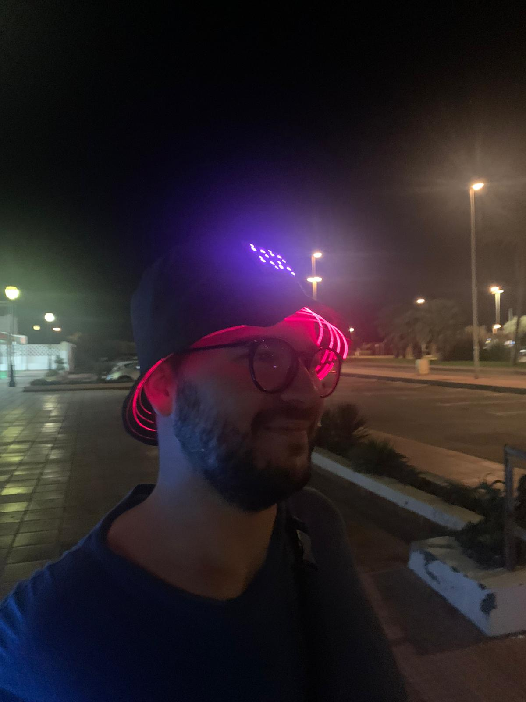

# Fiber-hat

Prototype of a optic fiber hat with some DotPixels. I'm using wemos D1 with micropython.

## Hardware used

* Wemos D1
* Battery Shield for wemos
* Lipo bat
* 24 Dotstar pixels
* Optic Fiber
* Some 5V red laser diodes

## Whats on this repository

On `3d` there is a 3d printed support for the pixels.

On `py` there is the micropython code for the wemos D1

## Output

## Authors

* Fran Acién, original work